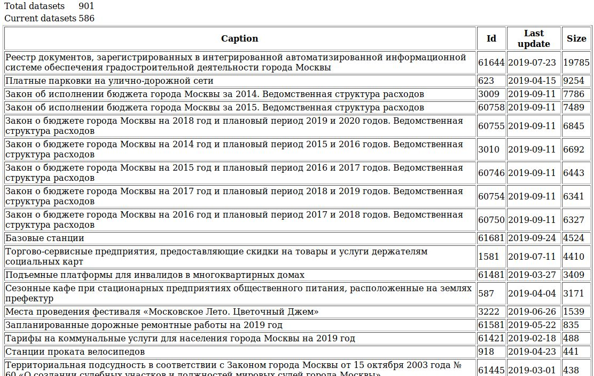

# data-mos-ru-explorer
A simplest possible demo that demonstrates getting data from http://data.mos.ru and showing it in a web page.

# Why
1. They store date as string in dd-mm-yyyy format so it's impossible to get freshest data sets via API.
2. You have to query individual data set to get its size so it's impossible to get largest data sets via API.

# How
1. Query list of data sets
2. Query size of top freshest data sets
3. Show largest of freshest data sets

# Building
```bash
./gradlew build
```

# Running
```bash
./gradlew bootRun &
firefox http://localhost:8080
```

# Using

1. Register at http://data.mos.ru as developer
2. Copy your API key from profile page
3. Enter your API key and submit the first form
4. Observe the result


